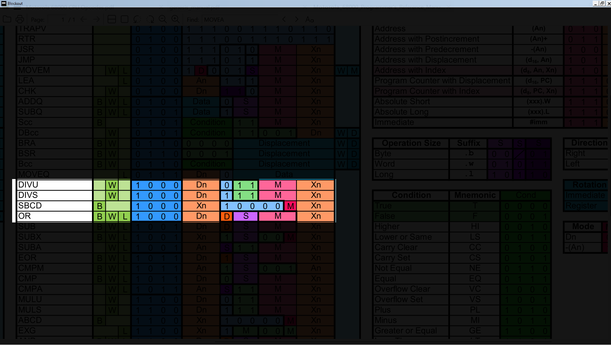

# Blockout

An overlay tool for blacking out regions of a screen.

## Archived 2023.09.07

Power Toys has a [nifty new feature](https://learn.microsoft.com/en-us/windows/powertoys/crop-and-lock) called crop & lock that is
better and easier to use.

## Use Case

While working with tables of dense data, my eyes sometimes wander which makes reading
at a glance a challenge. The idea is to provide a black overlay that allows the user
to click and draw a transparent hole through which interesting data can be viewed.



## Usage

Blockout can be run in two ways. The easy way is to launch from the CLI with the name of your target
application as the first parameter.

```
blockout firefox.exe
```

This will keep the overlay exactly over your Firefox browser and tracker its movement and resizing.

Alternatively, you may launch without any parmeters and fiddle with the location yourself.

## Improvements

- [X] Make it easier to draw the initial hole
- [ ] Support multiple holes
- [X] Automatically track an underlay window
- [ ] Support targeting a process at runtime (instead of launch)